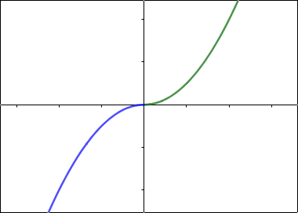

Author: Bibek Gautam
Date: 2019-03-29 21:07
Title: Curvature and Second Derivative
Category: Maths
Tags: graphs, functions,analytic-geometry
slog:xmodx -and-curvature
Summary: This is like a mental filter that makes function analysis easy. I found I wasn't thinking like this even though this is pretty elementary.

You know the function $y = \mid x \mid$ does not have a derivative at $x = 0$.
But what about the following function ?
$$  y  = x \mid x \mid $$

Does it have first derivative ? What about second derivative ?

As you might noticed, it does have a first derivative. In fact, the slope from
both sides approaches $0$ as $x\to 0$. But, the second derivative is
not the same. You could wonder about the definition of derivative, left and
right limits and so on. But there's a quicker way to be sure that second derivative
doesn't exist at $ x = 0$. Notice that the function is essentially this:

$$ y = \left\{
  \begin{array}{cc}
    - x^2 & x <  0, \\
    x^2 & x \geq 0
  \end{array}\right\}
$$

which looks something like below: 

And just realize that those are portions of two parabola, one facing up and
another facing downwards. They have opposite curvature as they approach $x=0$.
So, they can't have equal second derivatives. And hence, the second derivative doesn't exit at
$x=0$.

The End.
